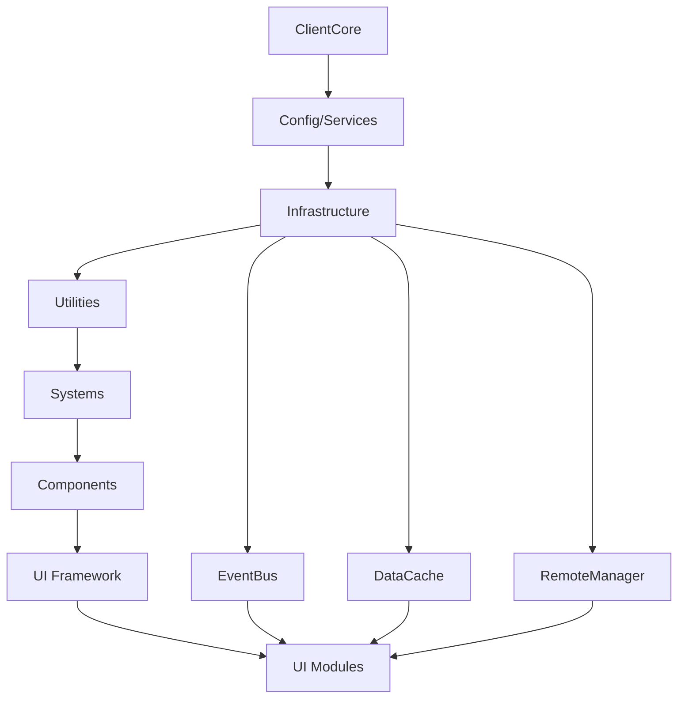

# SANRIO TYCOON CLIENT MODULARIZATION - MASTER PLAN

## 🎯 MISSION CRITICAL OBJECTIVES
1. **ZERO FUNCTIONALITY LOSS** - Every single feature must work exactly as before
2. **ZERO PERFORMANCE DEGRADATION** - Must be as fast or faster than monolithic version
3. **ZERO BREAKING CHANGES** - Must work with existing server infrastructure
4. **MAXIMUM MAINTAINABILITY** - Each module must be self-contained and documented
5. **MAXIMUM EXTENSIBILITY** - Easy to add new features without touching core

## 📊 CURRENT STATE ANALYSIS

### File Statistics
- **Total Lines**: 8,150
- **Total Functions**: ~200+
- **UI Modules**: 14 major modules
- **Utility Functions**: ~50+
- **Event Handlers**: ~100+
- **Remote Connections**: ~50+

### Current Architecture Issues
1. **Monolithic Structure** - Everything in one file makes it hard to maintain
2. **Tight Coupling** - UI modules directly reference each other
3. **Global State** - Shared state across modules without clear ownership
4. **No Clear Boundaries** - Functions scattered without clear organization
5. **Limited Testability** - Can't test individual components
6. **Performance Bottlenecks** - All code loads at once

## 🏗️ PROPOSED MODULE ARCHITECTURE

### Layer 1: Core Foundation (Loaded First)
```
ClientModules/
├── Core/
│   ├── ClientCore.lua          - Main entry point and orchestrator
│   ├── ClientConfig.lua         - All configuration and constants
│   ├── ClientServices.lua       - Roblox service references
│   ├── ClientConstants.lua      - Game-specific constants
│   └── ClientTypes.lua          - Type definitions and interfaces
```

### Layer 2: Infrastructure (Loaded Second)
```
├── Infrastructure/
│   ├── RemoteManager.lua        - Remote event/function management
│   ├── DataCache.lua            - Local data caching layer
│   ├── EventBus.lua             - Inter-module communication
│   ├── StateManager.lua         - Global state management
│   └── ModuleLoader.lua         - Dynamic module loading
```

### Layer 3: Utilities (Loaded Third)
```
├── Utilities/
│   ├── MathUtils.lua            - Number formatting, calculations
│   ├── UIUtils.lua              - UI helper functions
│   ├── ValidationUtils.lua      - Input validation
│   ├── AnimationUtils.lua       - Animation helpers
│   ├── DebugUtils.lua           - Debug helpers
│   └── PerformanceUtils.lua     - Performance monitoring
```

### Layer 4: Systems (Loaded Fourth)
```
├── Systems/
│   ├── SoundSystem.lua          - Sound caching and playback
│   ├── ParticleSystem.lua       - Particle effects
│   ├── NotificationSystem.lua   - Notifications
│   ├── EffectsSystem.lua        - Visual effects
│   ├── InputSystem.lua          - Input handling
│   └── LocalizationSystem.lua   - Text localization
```

### Layer 5: Components (Loaded Fifth)
```
├── Components/
│   ├── UIFactory.lua            - UI component creation
│   ├── Button.lua               - Button component
│   ├── Card.lua                 - Card component
│   ├── Modal.lua                - Modal component
│   ├── Tooltip.lua              - Tooltip component
│   ├── ScrollFrame.lua          - Custom scroll frame
│   ├── TabSystem.lua            - Tab navigation
│   └── GridLayout.lua           - Grid layout component
```

### Layer 6: UI Modules (Loaded On-Demand)
```
├── UI/
│   ├── Framework/
│   │   ├── MainUI.lua           - Main UI framework
│   │   ├── NavigationBar.lua    - Navigation system
│   │   └── WindowManager.lua     - Window management
│   │
│   ├── Modules/
│   │   ├── ShopUI/
│   │   │   ├── ShopUI.lua       - Main shop module
│   │   │   ├── EggCard.lua      - Egg card component
│   │   │   └── ShopData.lua     - Shop data handler
│   │   │
│   │   ├── InventoryUI/
│   │   │   ├── InventoryUI.lua  - Main inventory
│   │   │   ├── PetCard.lua      - Pet card component
│   │   │   ├── PetDetails.lua   - Pet details panel
│   │   │   ├── MassDelete.lua   - Mass delete system
│   │   │   └── FilterSort.lua   - Filter/sort system
│   │   │
│   │   ├── CaseOpeningUI/
│   │   │   ├── CaseOpeningUI.lua - Main case UI
│   │   │   ├── OpenAnimation.lua  - Opening animations
│   │   │   └── ResultDisplay.lua  - Result display
│   │   │
│   │   ├── TradingUI/
│   │   │   ├── TradingUI.lua    - Main trading
│   │   │   ├── TradeWindow.lua  - Trade window
│   │   │   └── TradeHistory.lua - Trade history
│   │   │
│   │   ├── BattleUI/
│   │   │   ├── BattleUI.lua     - Main battle UI
│   │   │   ├── BattleArena.lua  - Arena display
│   │   │   ├── BattleLog.lua    - Battle log
│   │   │   └── TeamSelection.lua - Team selection
│   │   │
│   │   ├── QuestUI/
│   │   │   ├── QuestUI.lua      - Main quest UI
│   │   │   ├── QuestCard.lua    - Quest card
│   │   │   └── QuestProgress.lua - Progress tracker
│   │   │
│   │   └── [Other UI Modules...]
```

### Layer 7: Debug & Development (Studio Only)
```
├── Debug/
│   ├── DebugPanel.lua           - Debug panel UI
│   ├── ModuleInspector.lua      - Module state inspector
│   ├── PerformanceProfiler.lua  - Performance profiling
│   └── NetworkMonitor.lua       - Network traffic monitor
```

## 🔄 DEPENDENCY FLOW



## 📝 DETAILED MODULE SPECIFICATIONS

### ClientCore Module
```lua
-- Purpose: Main entry point, orchestrates initialization
-- Dependencies: All core modules
-- Exports: Initialize(), Shutdown(), GetModule()

local ClientCore = {}

-- Initialization phases
function ClientCore:Initialize()
    -- Phase 1: Core setup
    -- Phase 2: Infrastructure
    -- Phase 3: Utilities
    -- Phase 4: Systems
    -- Phase 5: Components
    -- Phase 6: UI Framework
    -- Phase 7: Load saved UI state
end
```

### RemoteManager Module
```lua
-- Purpose: Centralized remote communication
-- Dependencies: ClientServices
-- Exports: Fire(), Invoke(), On(), Connect()

local RemoteManager = {}

-- Handles all remote communication
-- Provides queueing, retry logic, error handling
-- Tracks remote usage for debugging
```

### DataCache Module
```lua
-- Purpose: Local data caching with change detection
-- Dependencies: None
-- Exports: Get(), Set(), Subscribe(), Unsubscribe()

local DataCache = {}

-- Provides reactive data updates
-- Efficient diff detection
-- Memory management
```

### EventBus Module
```lua
-- Purpose: Decoupled inter-module communication
-- Dependencies: None
-- Exports: Fire(), On(), Once(), Off()

local EventBus = {}

-- Type-safe events
-- Event history for debugging
-- Performance monitoring
```

## 🚀 MIGRATION STRATEGY

### Phase 1: Foundation (Week 1)
1. Create folder structure
2. Extract configuration and constants
3. Create service references module
4. Set up module loader
5. Create event bus system

### Phase 2: Infrastructure (Week 2)
1. Extract remote management
2. Create data caching layer
3. Set up state management
4. Create utility modules
5. Test infrastructure layer

### Phase 3: Systems & Components (Week 3)
1. Extract sound system
2. Extract particle system
3. Extract notification system
4. Create UI component factory
5. Create reusable components

### Phase 4: UI Framework (Week 4)
1. Extract main UI framework
2. Create window manager
3. Extract navigation system
4. Set up UI state persistence
5. Test framework integration

### Phase 5: UI Modules Migration (Weeks 5-6)
1. Migrate one UI module at a time
2. Start with simplest (Settings)
3. Progress to complex (Inventory)
4. Maintain backwards compatibility
5. Test each migration thoroughly

### Phase 6: Optimization (Week 7)
1. Implement lazy loading
2. Optimize module dependencies
3. Add performance monitoring
4. Memory leak detection
5. Bundle optimization

### Phase 7: Polish & Documentation (Week 8)
1. Complete API documentation
2. Create usage examples
3. Write troubleshooting guide
4. Create developer tools
5. Final testing

## 🧪 TESTING STRATEGY

### Unit Testing
- Test each module in isolation
- Mock dependencies
- Test edge cases
- Performance benchmarks

### Integration Testing
- Test module interactions
- Test data flow
- Test event propagation
- Test error handling

### UI Testing
- Visual regression tests
- Interaction tests
- Animation tests
- Responsive tests

### Performance Testing
- Memory usage monitoring
- Frame rate analysis
- Load time measurement
- Network usage tracking

## 🛡️ RISK MITIGATION

### Rollback Strategy
1. Keep original script as backup
2. Feature flags for gradual rollout
3. Version control for each phase
4. Quick switch mechanism
5. Data migration tools

### Error Handling
1. Module-level error boundaries
2. Graceful degradation
3. User-friendly error messages
4. Automatic error reporting
5. Recovery mechanisms

### Performance Safeguards
1. Lazy loading for UI modules
2. Resource pooling
3. Debouncing/throttling
4. Memory limits
5. Performance budgets

## 📈 SUCCESS METRICS

### Technical Metrics
- **Load Time**: < 2 seconds
- **Memory Usage**: < 200MB
- **Frame Rate**: Stable 60 FPS
- **Module Size**: < 500 lines each
- **Test Coverage**: > 80%

### Quality Metrics
- **Bug Rate**: < 1 per module
- **Code Duplication**: < 5%
- **Cyclomatic Complexity**: < 10
- **Documentation Coverage**: 100%
- **Type Safety**: 100%

### Developer Experience
- **Module Independence**: High
- **Development Speed**: 2x faster
- **Debugging Time**: 50% reduction
- **Onboarding Time**: 75% reduction
- **Code Clarity**: Excellent

## 🎯 DELIVERABLES

### Week 1-2: Foundation
- [ ] Core module structure
- [ ] Configuration system
- [ ] Infrastructure layer
- [ ] Basic documentation

### Week 3-4: Systems
- [ ] All system modules
- [ ] Component library
- [ ] UI framework
- [ ] Integration tests

### Week 5-6: Migration
- [ ] All UI modules migrated
- [ ] Backwards compatibility
- [ ] Performance optimization
- [ ] Full test coverage

### Week 7-8: Polish
- [ ] Complete documentation
- [ ] Developer tools
- [ ] Performance tuning
- [ ] Production ready

## 🚨 CRITICAL CONSIDERATIONS

1. **State Synchronization** - Ensure UI state stays in sync with server
2. **Memory Management** - Prevent leaks in long play sessions
3. **Error Boundaries** - Isolate failures to individual modules
4. **Performance Budget** - Each module must meet performance criteria
5. **Backwards Compatibility** - Must work with existing server code
6. **Hot Reload** - Support development without restarts
7. **Type Safety** - Use type annotations everywhere
8. **Documentation** - Every public API must be documented
9. **Testing** - Every module must have tests
10. **Monitoring** - Built-in performance monitoring

## 📚 APPENDICES

### A. Module Template
### B. Testing Template
### C. Documentation Template
### D. Performance Checklist
### E. Security Checklist
### F. Accessibility Checklist
### G. Migration Checklist
### H. Code Review Checklist

---

This is a living document that will be updated throughout the modularization process.